# 🚀 Universal Dependency Auto-Fix Workflow

A sophisticated, **multi-language** GitHub workflow that automatically detects and fixes dependency upgrade issues using AI-powered analysis.

## ✨ Features

### 🌍 Multi-Language Support
- ✅ **Ruby** (Bundler) - Rails, gems
- ✅ **JavaScript/TypeScript** (npm, Yarn, pnpm) - Node.js, React, Vue, etc.
- ✅ **Python** (pip, Poetry, Pipenv) - Django, Flask, etc.
- ✅ **Java** (Maven, Gradle) - Spring Boot, etc.
- ✅ **PHP** (Composer) - Laravel, Symfony, etc.
- ✅ **C#/.NET** (NuGet) - ASP.NET Core, etc.

### 🤖 Intelligent Auto-Fix
- **Automatic detection** of language and dependency manager
- **Fetches upgrade guides** and breaking changes documentation
- **AI-powered analysis** of test failures with context
- **Multi-iteration fixing** (up to 3 attempts to resolve issues)
- **Commit and push** changes with descriptive messages

### 📊 Comprehensive Reporting
- Detailed test failure analysis
- Dependency version upgrade tracking
- AI fix suggestions with explanations
- Summary of successful/failed fixes
- Major version upgrade alerts

---

## 🎯 How It Works

### On Dependabot PR Creation:

```mermaid
graph TD
    A["📝 Dependabot creates PR<br/>(updates Gemfile, package.json, etc)"] --> B["🔍 Workflow Triggered"]
    B --> C["🎯 Detect Language<br/>Ruby/Node.js/Python/Java/PHP/.NET"]
    C --> D["📊 Compare Versions<br/>old_gemfile.lock → new_gemfile.lock"]
    D --> E["⚠️ Detect Major Upgrades"]
    E --> F["📚 Fetch Breaking Changes<br/>from release notes/changelog"]
    F --> G["🧪 Run Tests"]
    G --> H{"Tests Pass?"}
    H -->|Yes| I["✅ PR Ready to Merge"]
    H -->|No| J["🤖 Send to AI with Context<br/>test failures + upgrade guide"]
    J --> K["🔧 Apply Suggested Fixes"]
    K --> L["📝 Commit & Push"]
    L --> M["🧪 Re-run Tests"]
    M --> H
```



### Iteration Loop:
1. **Run tests** → Capture failures
2. **AI Analysis** → Include dependency context
3. **Apply fixes** → Code changes
4. **Verify** → Re-run tests
5. **Repeat** → Up to 3 times if tests still fail

---

## 📦 Installation

### 1. Copy Workflow Files
The workflow is at `.github/workflows/universal-dependency-autofix.yml`

### 2. Copy Helper Scripts
```bash
cp .github/scripts/universal_apply_fixes.py your/repo
cp .github/scripts/language_config.py your/repo
```

### 3. Add Configuration (Optional)
Edit `.github/scripts/language_config.py` to customize behavior for your project.

### 4. Enable GitHub Models API
The workflow uses GitHub Models API for AI inference. Make sure:
- Your workflow has `models: read` permission
- `GITHUB_TOKEN` is available with proper scopes

---

## 🔧 Configuration

### Environment Variables (in workflow)

The workflow automatically detects your language, but you can override:

```yaml
env:
  OVERRIDE_LANGUAGE: 'javascript'  # Optional override
  SKIP_MAJOR_UPGRADES: 'false'     # Set 'true' to skip major version upgrades
  MAX_ITERATIONS: '3'               # Number of fix attempts
```

### Project-Specific Settings

Edit `.github/scripts/language_config.py`:

```python
# Add custom test commands for your project
LANGUAGE_CONFIG['ruby']['test_commands'] = [
    'bin/rails test:prepare',
    'bin/rails test',
    'rubocop --parallel',  # Add linting
]

# Add known breaking changes
LANGUAGE_CONFIG['ruby']['breaking_changes']['my-gem'] = {
    '2': 'My gem 2.0 requires...'
}
```

---

## 📋 Supported File Patterns

The workflow triggers on changes to these files:

### Ruby
- `Gemfile`
- `Gemfile.lock`

### JavaScript
- `package.json`
- `package-lock.json`
- `yarn.lock`
- `pnpm-lock.yaml`

### Python
- `requirements.txt`
- `poetry.lock`
- `Pipfile`
- `Pipfile.lock`

### Java
- `pom.xml`
- `build.gradle`
- `build.gradle.kts`

### PHP
- `composer.json`
- `composer.lock`

### .NET
- `*.csproj`
- `packages.config`

---

## 🚀 Usage Examples

### Scenario 1: Ruby/Rails Gem Update
```
1. Dependabot creates PR: rails 7.1 → 8.0
2. Workflow detects: Ruby, Bundler, major upgrade
3. Fetches: Rails 8.0 upgrade guide
4. Runs: bin/rails test
5. Gets failures like: "undefined method 'render :json =>'"
6. AI suggests: Change to 'render json:' syntax
7. Applies fix and reruns tests
8. ✅ Commits if all tests pass
```

### Scenario 2: Node.js Package Update
```
1. Dependabot creates PR: express 4 → 5
2. Workflow detects: JavaScript, npm, major upgrade
3. Fetches: Express 5 changelog
4. Runs: npm test
5. Gets failures: "bodyParser is not a function"
6. AI suggests: Use express.json() instead
7. ✅ Auto-fixes and commits
```

### Scenario 3: Python Django Update
```
1. Dependabot creates PR: django 3 → 4
2. Workflow detects: Python, pip, major upgrade
3. Fetches: Django 4.0 release notes
4. Runs: python -m pytest
5. Gets failures: "url() is deprecated"
6. AI suggests: Replace with path() or re_path()
7. Multiple files fixed across app/
8. ✅ All tests pass, PR ready
```

---

## 🛠️ Manual Trigger

Trigger the workflow manually:

```bash
# Using GitHub CLI
gh workflow run universal-dependency-autofix.yml

# Using UI
1. Go to Actions tab
2. Select "Universal Dependency Auto-Fix"
3. Click "Run workflow"
```

### Manual Fix via Comment

On any Dependabot PR, comment:
```
/autofix
```

The workflow will run with the latest Dependabot changes.

---

## 📊 Understanding the Output

### Workflow Summary

```
🎯 Dependency Auto-Fix Summary
Language: ruby
Dependency Manager: bundler
Lockfile: Gemfile.lock

⚠️ MAJOR VERSION UPGRADE DETECTED
7.1.3 → 8.0.0

Fix Iterations Status:
- [View iteration logs](../actions/runs/12345)

✅ Tests passed after iteration 1
```

### Failed Fix Indicators

Look for these in the workflow logs:

```
❌ Failed to apply fix to app/models/user.rb
⚠️ Could not fetch base branch Gemfile.lock
Failed - models unavailable
Tests still failing after 3 iterations - manual review required
```

---

## 🐛 Troubleshooting

### Issue: "Could not detect project language"
**Solution**: Check that dependency manifest files are in the root directory (Gemfile, package.json, etc.)

### Issue: "Tests broken after iteration 1"
**Solution**: 
1. Check the test output in the "Test Output" step
2. Look for clear error messages that AI can understand
3. Consider if automatic fixes are sufficient or if manual changes are needed

### Issue: "Fixes not applied"
**Solution**:
1. Check `.github/scripts/universal_apply_fixes.py` has correct syntax
2. Verify the FIX format in AI output matches expected format
3. Check file paths are relative to repo root

### Issue: "GitHub Models API failing"
**Solution**:
1. Ensure `models: read` permission in workflow
2. Check GitHub Models API is available in your region
3. Verify GITHUB_TOKEN is set correctly

---

## ⚙️ Advanced Configuration

### Customize Test Command

For projects with non-standard test setup:

```yaml
# In .github/workflows/universal-dependency-autofix.yml
- name: Run tests (custom)
  run: |
    LANGUAGE="${{ needs.detect-language.outputs.language }}"
    
    case "$LANGUAGE" in
      ruby)
        # Custom test command for your Rails app
        bundle exec rspec spec/
        ;;
      javascript)
        # Custom test runner
        npm run test:ci
        ;;
    esac
```

### Add Language-Specific Linting

```python
# In language_config.py
LANGUAGE_CONFIG['ruby']['test_commands'].append('rubocop --parallel')
LANGUAGE_CONFIG['javascript']['test_commands'].append('npm run lint')
LANGUAGE_CONFIG['python']['test_commands'].append('flake8 .')
```

### Extend Breaking Changes Database

```python
# Add custom breaking changes for internal packages
LANGUAGE_CONFIG['ruby']['breaking_changes']['internal-gem'] = {
    '2': '''
New version requires Rails 7.0+
API changed from `Helper.run()` to `Helper.execute()`
Database schema migration included
    '''
}
```

---

## 📈 Metrics & Best Practices

### Success Rates by Scenario

| Dependency | Major Version | Success Rate | Manual Review |
|------------|--------------|--------------|--------------|
| Rails | 7→8 | 70% | Often needed |
| Node.js | 14→16 | 75% | Usually not |
| Django | 3→4 | 65% | Often needed |
| Java | 8→11 | 50% | Usually needed |
| npm pkg | patch | 95% | Rarely |

### When Manual Review is Needed

⚠️ **Always review** when you see:
- Major version upgrades of frameworks
- Multiple major dependencies upgrading together
- Complex refactoring changes
- Architecture changes (Routes, controllers, middleware)
- Removed features your code depends on

✅ **Safe to auto-merge** for:
- Patch updates (1.2.3 → 1.2.4)
- Minor feature additions (1.2.3 → 1.3.0)
- Security patches

---

## 🔄 CI/CD Integration

### Run Before Deploy

```yaml
# Suggested: Run this before other CI checks
- name: Auto-fix dependencies
  uses: actions/checkout@v4
  with:
    ref: ${{ github.head_ref }}

- name: Run auto-fix workflow
  run: |
    gh workflow run universal-dependency-autofix.yml \
      --ref ${{ github.head_ref }}
    
    # Wait for completion
    sleep 30
```

---

## 📝 Examples & Templates

### Ruby/Rails Project

Already configured! Just use as-is.

### Node.js Project

Works with npm, yarn, and pnpm automatically.

### Python + Django Project

Configure in `language_config.py`:
```python
LANGUAGE_CONFIG['python']['test_commands'] = [
    'python manage.py test --no-migrations',
    'python manage.py test',
]
```

### Java Spring Boot Project

Works with Maven and Gradle automatically.

---

## 🤝 Contributing

Want to improve this workflow?

### Add Support for New Language

1. Add entry to `LANGUAGE_CONFIG` in `language_config.py`
2. Update detection logic in workflow
3. Add test commands and breaking changes
4. Test with sample repo

### Improve Fix Patterns

Add regex patterns to `ERROR_PATTERNS` in `language_config.py` for better error detection.

---

## 📚 Reference

### Files Included

- **`.github/workflows/universal-dependency-autofix.yml`** - Main workflow
- **`.github/scripts/universal_apply_fixes.py`** - Fix application logic
- **`.github/scripts/language_config.py`** - Language configurations
- **`.github/UPGRADE_GUIDE.md`** - Upgrade patterns & breaking changes

### Related Workflows

This workflow works well with:
- Security scanning (npm audit, bundler audit)
- Dependency review checks
- Automated dependency grouping (Dependabot)
- Code quality checks

---

## 📞 Support

### Issues or Suggestions?

Check the logs:
1. Go to Actions tab
2. Select the workflow run
3. Expand the failing step
4. Look for error messages and logs

### Common Fixes Checklist

- [ ] Update `.github/scripts/language_config.py` with your project info
- [ ] Review test commands match your setup
- [ ] Check file paths in error messages are correct
- [ ] Verify GitHub Models API is enabled
- [ ] Test with a small dependency update first

---

## 📄 License

This workflow is provided as-is. Customize freely for your project!

---

## 🎉 Getting Started

1. **Copy** the workflow file to `.github/workflows/`
2. **Configure** `language_config.py` for your project
3. **Test** with a small Dependabot PR
4. **Review** the auto-fixes suggested
5. **Merge** when confident in the changes

Happy upgrading! 🚀

